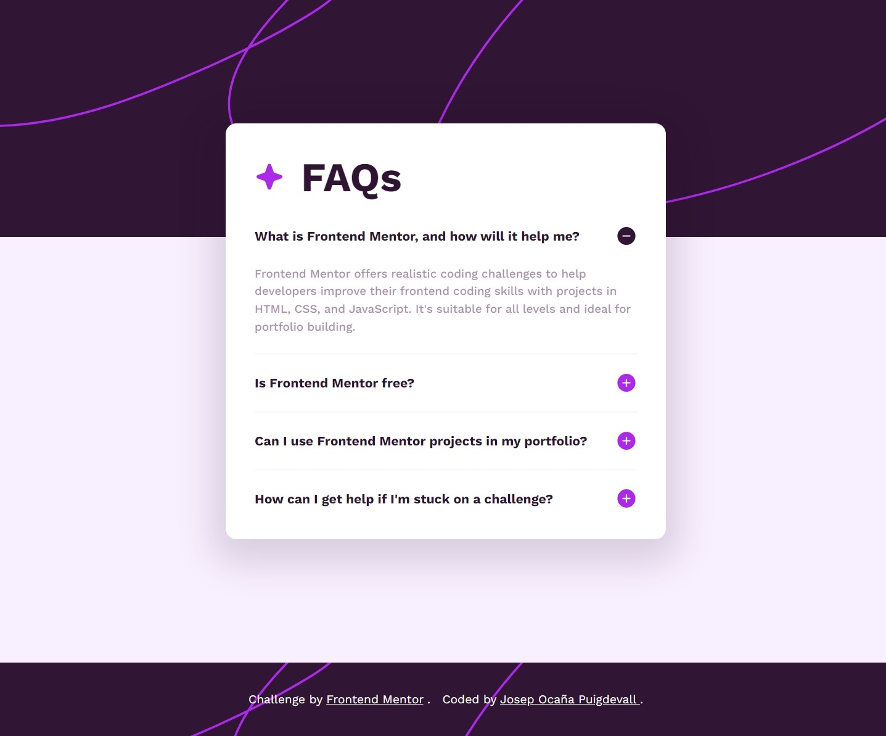

# Frontend Mentor - My FAQ accordion solution

This is a solution to the [FAQ accordion challenge on Frontend Mentor](https://www.frontendmentor.io/challenges/faq-accordion-wyfFdeBwBz). Frontend Mentor challenges help you improve your coding skills by building realistic projects.

## Table of contents

-   [Overview](#overview)
    -   [The challenge](#the-challenge)
    -   [Screenshot](#screenshot)
    -   [Links](#links)
-   [My process](#my-process)
    -   [Built with](#built-with)
    -   [What I learned](#what-i-learned)
    -   [Continued development](#continued-development)
    -   [Useful resources](#useful-resources)
-   [Author](#author)
-   [Acknowledgments](#acknowledgments)

## Overview

### The challenge

Users should be able to:

-   Hide/Show the answer to a question when the question is clicked
-   Navigate the questions and hide/show answers using keyboard navigation alone
-   View the optimal layout for the interface depending on their device's screen size
-   See hover and focus states for all interactive elements on the page

### Screenshot

#### Desktop



#### Desktop


#### Active-states


#### Desktop


### Links

-   Solution URL: [@Pepekid_faq-accordion-main-project](https://github.com/Pepekid/frontendMentor-faq-accordion)
-   Live Site URL: [@Pepekid_faq-accordion-main-page](https://frontend-mentor-pepekid-faq-accordion.netlify.app/)

## My process

### Built with

-   Semantic HTML5 markup
-   CSS custom properties
-   Flexbox
-   Javascript

### What I learned

In this project I've worked with HTML, CSS and Javascript.

I learnt how select elements in js using attributes that I create in HTML:

```html
<button
	class="accordion-container-header"
	aria-expanded="false"
	aria-controls="accordion-content-1"
>
	...
</button>
<div id="accordion-content-1" class="accordion-content" hidden>
	Frontend Mentor ...
</div>
```

CSS well-structured and using flexbox to positioning elements:

```css
.attribution {
	display: flex;
	justify-content: center;
	gap: 1rem;
	width: 100vw;
	padding: 2.5rem;
	text-align: center;
	text-decoration: none;
	color: var(--white);
	background: url('../images/background-pattern-desktop.svg') repeat-x;
}
```

I use atributes to control my elements in js:

```js
button.forEach(element => {
	element.addEventListener('click', e => {
		e.preventDefault();

		const idButton = element.getAttribute('aria-controls');
		const content = document.getElementById(idButton);
		//...
	});
});
```

### Continued development

-   I would like to continue creating projects from scratch with HTML, CSS and javascript
-   I'm interested in learning _React_ too.

### Useful resources

-   [Stackoverflow](https://es.stackoverflow.com/questions/24819/qu%C3%A9-son-los-atributos-aria#:~:text=ARIA%20describe%20como%20agregar%20la,para%20personas%20con%20alguna%20discapacidad.) - I learned that we have to take into account how to add semantics to our content to make the interface controls more dynamic and more accessible especially for people with disabilities.

## Author

-   Frontend Mentor - [@Pepekid](https://www.frontendmentor.io/profile/Pepekid)

## Acknowledgments

-   I would like to thank frontend mentor for doing these exercises that help so many people to improve and refine their code for a better future.
-   I would like to thank w3schools and MDN Web Docs for offering so much support to the people and the community of developers who are always helping by solving problems and teaching.

-   I would also like to thank Miki for motivating me and for his support.

-   I would also like to thank my family for their support and for let me **_"play"_** so many time with the computer. `:)` Jejeje
